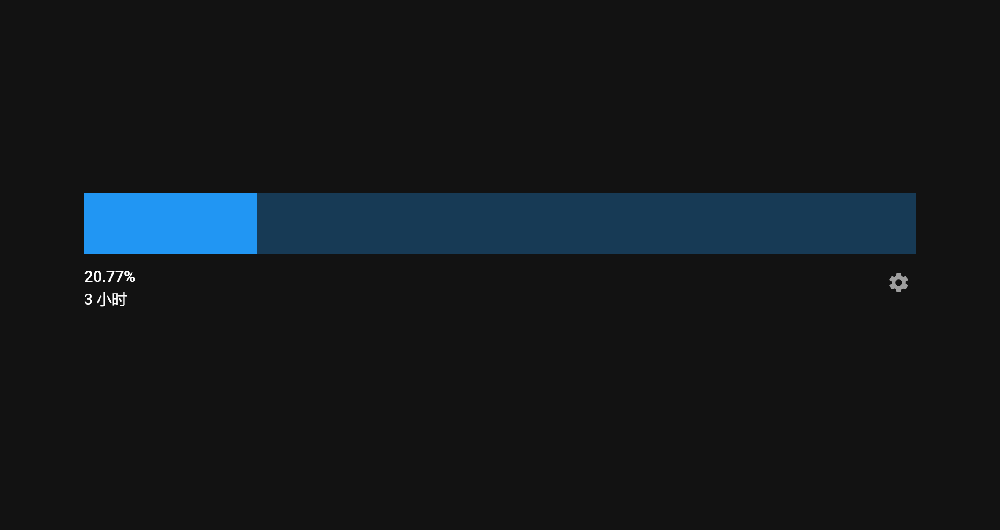

# day-progress



显示今天剩余时间的进度条。以起床时间开始，睡觉时间结束（默认是9:00~22:00），让你直观感受时间流逝，把握时间完成工作，从而按时睡觉。

之所以写这个，是因为找了很多个显示时间进度条的项目都不满足我的需求，那些项目都是统计0:00~24:00的，容易给人晚上时间很多的错觉，从而习惯熬夜。

[在线DEMO](https://tiaod.github.io/day-progress/)

推荐使用[Wallpaper engine](https://www.wallpaperengine.io/)或者[lively](https://github.com/rocksdanister/lively)之类的工具设置为桌面背景。

看着时间像手机电池电量一样减少，感觉是很奇妙的。

## Features
- 自定义开始和结束时间
- 暗色/亮色模式
- 自定义主题颜色
- 设置背景图片（需要填写背景图片的地址）
- 参数保存到url，方便复制链接到lively设置壁纸


# Project setup
```
npm install
```

### Compiles and hot-reloads for development
```
npm run serve
```

### Compiles and minifies for production
```
npm run build
```

### Customize configuration
See [Configuration Reference](https://cli.vuejs.org/config/).
